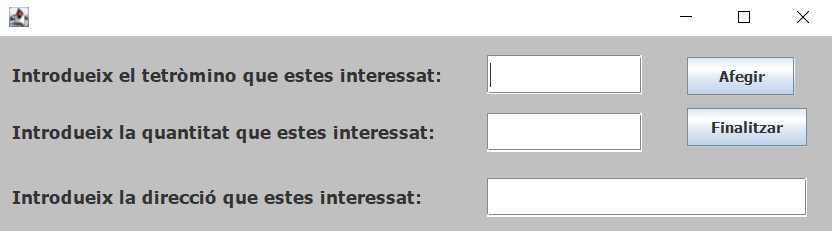

<h1 align="center">PSP_AE01</h1> 

<h2>Creado por:</h2> 
Rosa Mª Bosch Máñez

[Porfolio](https://github.com/roboma-04/Porfolio)

<h2>Descripción APP</h2> 

La APP consiste en dos clases, Manufacture y Order, hecho en Eclipse.

<h2>Descripción Manufacture</h2> 

La clase Manufacture gestiona la fabricación de tetrominos mediante máquinas virtuales. Utiliza hilos para simular la producción de piezas y proporciona métodos para realizar pedidos, controlar el proceso de fabricación y almacenar la información relevante. También tiene una clase interna TetrominoRunnable, la funcionalidad es que devuelve el tiempo de fabricación en milisegundos según el tipo de tetromino.

<h4>Funcionalidades</h4> 

1. Inicia hilos para fabricar tetrominos según las especificaciones dadas.

2.  Gestiona el límite de máquinas virtuales y espera hasta que haya una máquina disponible.

3.  Espera a que todas las piezas se fabriquen antes de continuar.

4.  Guarda el orden de fabricación en un archivo si se ha fabricado alguna pieza.

5.  Imprime la lista de piezas fabricadas si se especifica.

<h2>Descripción Order</h2> 

La clase Order representa la interfaz gráfica para realizar pedidos de tetrominos. Permite a los usuarios ingresar información como el tipo de tetromino, la cantidad y la dirección para realizar pedidos y gestionar el proceso de fabricación.

<h4>Funcionalidad</h4> 

Configura la interfaz gráfica con botones, campos de texto y etiquetas.

